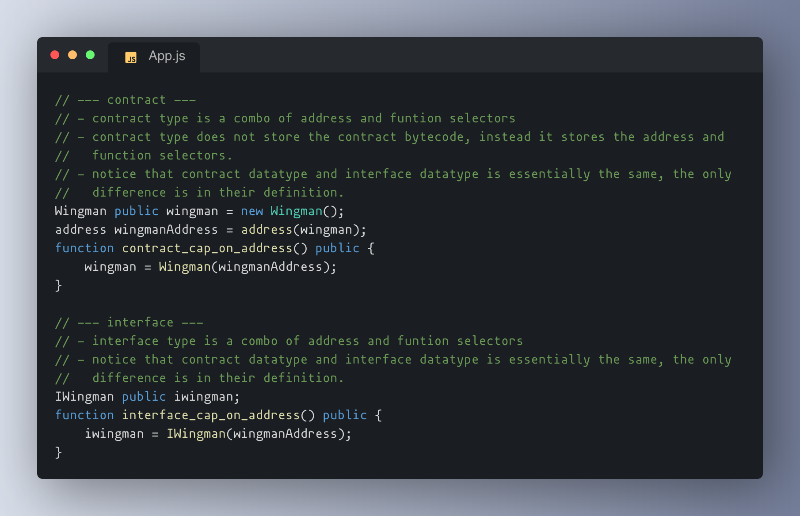
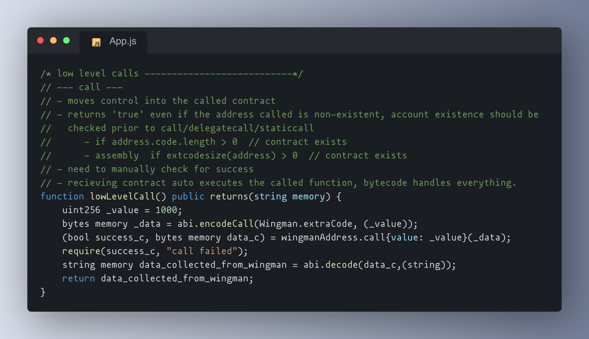

# Essential-Solidity (1/5) 

[](https://soliditylang.org)
[](https://www.gnu.org/licenses/gpl-3.0.html)


Solidity docs can be overwhelming, if you want something short, Essential-Solidity is exactly that. Its everything that you need with Clear Crisp and Consice notes supported by examples that compile. Now keep all your nuanced learnings stacked up in one place.





## Features

- **Beginner Friendly** - well structured notes explained in plain english
- **Clean Structure** - better organization, no confusion
- **Nuanced Notes** - edges around using certain solidity featurs are well addressed


## Highlights

| Section               | Highlights                          | Pro Tip Included? |
|-----------------------|-------------------------------------|-------------------|
| **OOP**               | C3 Linearization, `super` vs `override` | ✅            |
| **Low-Level Calls**   | When to use `delegatecall`          | ✅                |
| **Bitmasking**        | Pack 2x uint128 into 1 uint256      | ✅ (Packing demo) |
| **ABI Encoding**      | hash collisions encode vs encodePacked | ✅           |
| **type conversions**  | datatype nuances                    | ✅ (implicit explicit)|
| **error handling**    | throwing vs bubbling                | ✅ (try-catch)    |


## Getting Started
### foundry
```bash
  git clone https://github.com/AtharvSan/Essential-Solidity.git
  cd Solidity
  forge install
  forge compile
```
### remix 
just copy the code from src/Solidity.sol into remixIDE and you can start playing around.

## Roadmap
Part 1 of a 5 part series on essentials for solidity devs
- Essential-Solidity
- Essential-Cryptography
- Essential-Assembly
- Essential-designPatterns
- Essential-security

## FAQ

**How is this different from Solidity docs?**  
Solidity docs can be overwhelming, if you want something short, Essential-Solidity is exactly that. Its everything that you need with Clear Crisp and Consice notes supported by examples that compile.

**Can I contribute?**
Yes, Contributors are welcome.

**Where are notes on security and other important topics?**
Check Roadmap, I am organizing notes in seperate repos.


## License
This project is licensed under the GNU General Public License v3.0 (GPL)

---

**Found this useful?** consider dropping a [star ⭐](https://github.com/AtharvSan/Solidity) , your support will motivate me to do more such works.

[](https://twitter.com/AtharvSan)
[](https://github.com/AtharvSan)